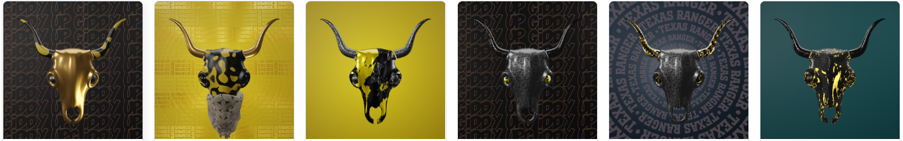

# Bufalo's NFT Collection - BOTV Skulls (BOTV)



---

[Bufalo](https://twitter.com/bufalomusic) is a DJ performing in the Decentraland metaverse, bringing "Futuristic Western Music" to people.

The DJ / Producer / Visual Artist is launching an NFT collection for its community. The tokens' aims to :

- offer physical goodies
- unlock several airdrops (Decentraland wearables, among other surprises)
- give VIP access into the Bufalo Saloon in Decentraland
- receive a share of the income from deals with music labels

A staking program gives the opportunity to get :

- commercial rights for music releases produced by Bufalo
- exclusive perks

## Core information

⛓️ Chain : Polygon PoS

🔢 Supply : 1000 tokens

🖼️ A unique art skull with seven traits (several rarities) and a 🎵 loop. Reveal date to be confirmed

📅 Private sale (wallets on "Community" allowlist only) and public sale dates to be confirmed

🔖 Sale price : 0.05 WETH per token, 50 % discount on the second mint for wallets on the "Fans" allowlist

🎁 Hat, trench coat & skull wearables offered on mint

🔢 10 tokens max per wallet

👑 10 % royalties

💵 Treasury (Oxsplits contract) : [0x0231339790F09B5F3d50a37D0dd82D66e82cA37D](https://app.0xsplits.xyz/accounts/0x0231339790F09B5F3d50a37D0dd82D66e82cA37D/?chainId=137)

💰 Collect points when staking an NFT

🌐 More info on the website coming soon [bufalomusic.com](https://bufalomusic.com)

## Allowlists

### Community allowlist : private sale access

All token owners from previous Bufalo collections are admissible on the "Community" allowlist. See the list of eligible collections [here](./data/inputs/previous-collections/index.js).

### Fans allowlist : discount on the second mint

Those who supported Bufalo up to $50 are on the "Fans" allowlist, and get a 50% discount on the second token. Amounts are computed on USD-basis (rate at the time of sale), from :

- Decentraland purchases
- [Bufalo NFT realeases'](https://opensea.io/collection/bufalonftreleases) transactions on Opensea (Ethereum & Polygon). See the list of eligible tokens [here](./data/inputs/previous-collections/opensea-nftreleases.js).

### Generate the allowlists

```bash
npm run snapshot
```

Result files can be found inside the `data/results` folder

| Generated file                                                      | Description                                                                                                                                                        |
| ------------------------------------------------------------------- | ------------------------------------------------------------------------------------------------------------------------------------------------------------------ |
| [Community allowlist](./data/results/allowlists/community.json)     | Array of addresses                                                                                                                                                 |
| [Fan allowlist](./data/results/allowlists/fans.json)                | Array of addresses                                                                                                                                                 |
| [Activity snapshot](./data/results/communityActivity/snapshot.json) | On-chain collected data                                                                                                                                            |
| [Sales](./data/results/communityActivity/totalSales.csv)            | Paid transactions summary ([see Google Spreadsheet version](https://docs.google.com/spreadsheets/d/1jFPqO3S3dCODnYy4J-3v0ztPCuOTN7Qsvka_N4w_-K8/edit?usp=sharing)) |
| [Community merkle](./data/results/merkleAllowlists/community.json)  | Merkle root & proofs for each address on the Community allowlist                                                                                                   |
| [Fan merkle](./data/results/merkleAllowlists/community.json)        | Merkle root & proofs for each address on the Fan allowlist                                                                                                         |

### Mint : get merkle proofs for a specific address

You can fetch `https://bufalo-api.anthonygourraud.workers.dev/merkleproofs/:addr` to get the merkle proofs for an address `addr`.

```js
// Result from https://bufalo-api.anthonygourraud.workers.dev/merkleproofs/0x64E8f7C2B4fd33f5E8470F3C6Df04974F90fc2cA
{
  "addr": "0x64e8f7c2b4fd33f5e8470f3c6df04974f90fc2ca",

  // is from Community allowlist
  "privateSaleMerkleProof": [
    "0xf806f5cd65739e428b11a3ea4315bede7d4b7db9c4adfccf29aa190bea93bb49",
    "0x9be2234643f345ad2fc383d774cfb4ade9b95ddc3f775aa11f5d67cfc1a6f93d",
    "0x026d169d9af6772c2640fff89fab8deb458135758da03f98ce79381ff6ed6ed5",
    "0xff36a9202b7233e65e56593e7ca76ccfcb4694a7af2ee7bba08c0c76891aa65d",
    "0x9b60f25ad7f6bb311720575cc493b42800646f2a9a4175a8043c5e6227ce67dd",
    "0x19f8066e52454dcd09f56b5949bd3c236db0f2b83b5f184440de3b0f2444ed6f",
    "0xa2f90180d7645840f22be763afb2455a4820700096ca5805f7fae3781cf69502",
    "0xb3f11d608f709422e6a827fea3e1a4267f5109870d7166691de09ab391af812b",
    "0xccfdf847c00a1ce4eadd7dde190dd65612d6efbf9056f3a39b43a2d2b3252042"
  ],

  // is not from Fans alllowlist
  "discountMerkleProof": []
}
```

API route is updated and deployed after generating allowlists. It can be deployed manually with `npm run deploy-api`

## Tech Stack

**API Deployment** : Cloudflare Workers

**Interfaces** : Decentraland NFT API (DCL sales), NFTPort API (NFT data), Alchemy (Blockchain data), Coingecko (Prices history)

**Snapshot script, tests :** Node v18

**Smart contract language:** Solidity

**Smart contract framework:** Hardhat

**Smart contract libs and tools:** OpenZeppelin, Thirdweb, Chainlink

## Roadmap

✅ Generate allowlists (addresses arrays & merkle data), from token ownerships and sales

🔲 NFT metadata (skull images) & uploads on IPFS

🔲 ERC721A contract for skull NFTs

- ERC4907 rentable NFT token standard and ERC2981 royalties implementations
- Minting price configurable for any ERC20 and/or blockchain's native coin
- Discounts & private sale access with Merkle proof verification
- Hat, trench coat & skull wearable transfers on mint
- Reveal with random assignation using Chainlink

🔲 ERC20 and staking contracts

- The longer you stake the skull NFT, the more ERC20 tokens you get. Get 80 BUFA every 6 hours in staking.

🔲 ERC721A for music NFTs

- Can be purchased burning ERC20 tokens
- NFT holder get commercial rights to the related music

## Development

You need NodeJS installed on your computer.

Clone the project and install the dependencies :

```bash
git clone git@github.com:antho31/bufalo-nft-skulls.git
npm install
```

Then set your environment variables :

```bash
cp .env_example .env
nano .env
```

### Environment Variables

| Parameter                      | Type     | Description                                                                                                                                                             |
| :----------------------------- | :------- | ----------------------------------------------------------------------------------------------------------------------------------------------------------------------- |
| `ALCHEMY_API_KEY`              | `string` | **Required to regenerate allowlists**. API key from [Alchemy](https://docs.alchemy.com/docs/alchemy-quickstart-guide#1key-create-an-alchemy-key)                        |
| `COINMARKETCAP_KEY`            | `string` | **Required for gas report**. API key from [CoinMarketCap](https://coinmarketcap.com/api/)                                                                               |
| `DEPLOYER_ADDRESS`             | `string` | **Required to test & deploy contracts**. The address to use to deploy contracts. Should also be owner of NFTs to airdrop.                                               |
| `DEPLOYER_PRIVATE_KEY`         | `string` | **Required to test & deploy contracts** Private key of the address to use to deploy contracts.                                                                          |
| `NFT_PORT_API_KEY`             | `string` | **Required to regenerate allowlists**. API key from [NFTPort](https://docs.nftport.xyz/)                                                                                |
| `POLYGON_MAINNET_RPC_PROVIDER` | `string` | **Required to deploy contracts** RPC endpoint (Polygon Mainnet). You can get one for free with [Alchemy](https://www.alchemy.com/overviews/private-rpc-endpoint)        |
| `POLYGON_MUMBAI_RPC_PROVIDER`  | `string` | **Required to deploy contracts** RPC endpoint (Polygon Mumbai Testnet). You can get one for free with [Alchemy](https://www.alchemy.com/overviews/private-rpc-endpoint) |

### Smart contracts deployment

You can use [Thirdweb](https://portal.thirdweb.com/release) to deploy contracts

```bash
  npx thirdweb release
```

### Tests

```shell
npm run test # with gas reports according hardhat.config.js
```

To ensure that any Solidity function is tested, run the `coverage` script :

```shell
npm run coverage
```

### Security

/!\ Contracts are not audited yet.

Slither runs a suite of vulnerability detectors, prints visual information about contract details.

1. Install Slither

```shell
pip3 install slither-analyzer
```

See alternatives to install Slither on the [GitHub repo](https://github.com/crytic/slither)

2. Run Slither

```shell
npm run analyze
```

## Authors

- [Anthony Gourraud - @antho31](https://www.github.com/antho31)
